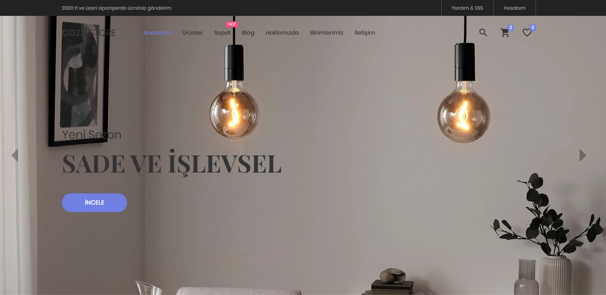

# CozaStore Web Sitesi Projesi

Bu proje, **CozaStore** adlı bir avize satış mağazasının çevrimiçi varlığını güçlendirmek amacıyla tasarlanmış bir e-ticaret web sitesidir.

## Proje Özeti

CozaStore web sitesi, kullanıcıların avize ürünlerini kolayca görüntüleyebileceği, satın alabileceği ve mağaza ile iletişim kurabileceği bir platform sunmaktadır. Web sitesi aşağıdaki temel sayfalardan oluşmaktadır:

- **Ana Sayfa**: Ürün tanıtımları, duyurular ve kampanyalar.
- **Ürün Sayfaları**: Ürün detayları, fiyatlar ve kullanıcı yorumları.
- **Duyuru Sayfası**: Kampanyalar ve fırsatlar hakkında bilgiler.
- **Sepet Sayfası**: Alışveriş sepeti işlemleri.
- **Blog Sayfası**: Avize ve aydınlatma konularında içerikler.
- **Birimlerimiz Sayfası**: Müşteri hizmetleri ve insan kaynakları bölümleri.
- **İletişim Sayfası**: İletişim formu ve Google Maps entegrasyonu.
- **Admin Paneli**: Ürün, duyuru ve blog ekleme, veri yönetimi, istatiksel bilgiler.

---

## Kullanılan Teknolojiler

Projenin geliştirilmesinde aşağıdaki teknolojiler ve araçlar kullanılmıştır:

- **HTML5**: Sayfa yapısını oluşturmak için.
- **CSS**: Sayfa tasarımı ve stil yönetimi için.
- **JavaScript**: Dinamik ve etkileşimli özellikler eklemek için.
- **Bootstrap**: Responsive (mobil uyumlu) tasarım için.
- **Google Maps API**: Mağaza konum bilgisi için harita entegrasyonu.
- **Chart.js**: İstatistiksel grafikler oluşturmak için.
- **FontAwesome**: İkonlar için.

---

## Proje Kurulumu

1. **Dosyaları İndirin**: Proje dosyasını indirin ve bir dizine çıkartın.
   
2. **Gerekli Bağımlılıkları İndirin**:
   - [Bootstrap](https://getbootstrap.com/docs/5.3/getting-started/introduction/)
   - [FontAwesome](https://fontawesome.com)
   - [Chart.js](https://www.chartjs.org)

3. **Web Sitesini Çalıştırın**:
   - Ana dizindeki `index.html` dosyasını bir tarayıcıda açarak projeyi görüntüleyebilirsiniz.

---

## Özellikler

- **Responsive Tasarım**: Mobil, tablet ve masaüstü cihazlarla uyumludur.
- **Admin Paneli**: Ürün ve duyuru ekleme, içerik yönetimi.
- **İstatistiksel Grafikler**: Web sitesinin faaliyetleri ile ilgili veri görselleştirmeleri.
- **Duyuru ve Kampanyalar**: Açılır pencere (modal) ile duyurular gösterimi.
- **Kullanıcı Dostu Arayüz**: Basit ve anlaşılır gezinme menüleri.

---

## Ekran Görüntüleri

1. **Ana Sayfa**  
   

2. **Ürün Sayfası**  
   

3. **Sepet Sayfası**  
   
   
4. **Admin Paneli**  
   
---

## Kaynaklar

- [Free HTML5 E-commerce Template](https://themewagon.com/themes/free-html5-ecommerce-website-template/)
- [Bootstrap Documentation](https://getbootstrap.com/docs/5.3/getting-started/introduction/)
- [W3Schools Chart.js Guide](https://www.w3schools.com/ai/ai_chartjs.asp2.0)
- [IKEA Aydınlatma Ürünleri](https://www.ikea.com.tr/kategori/aydinlatma)

---
